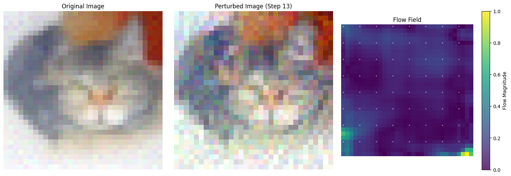
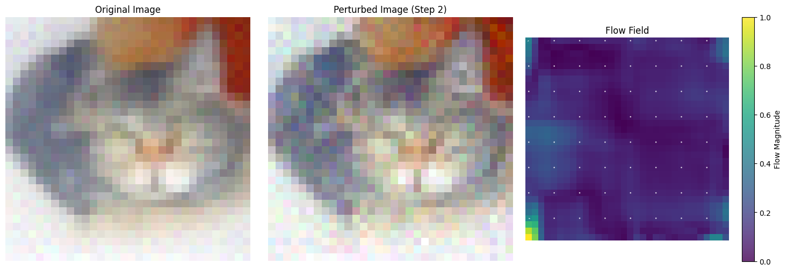
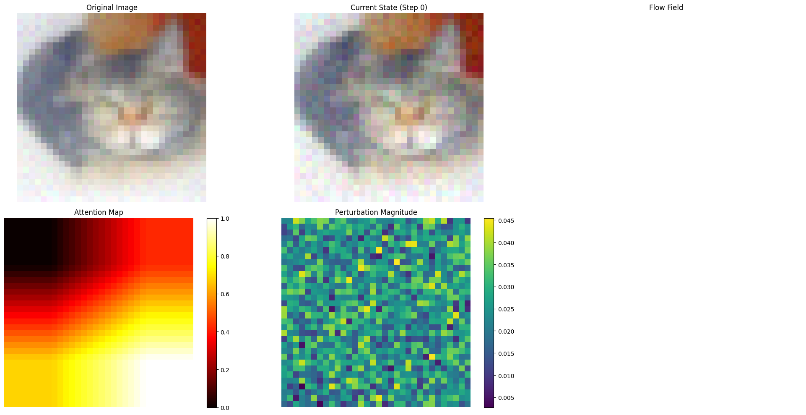
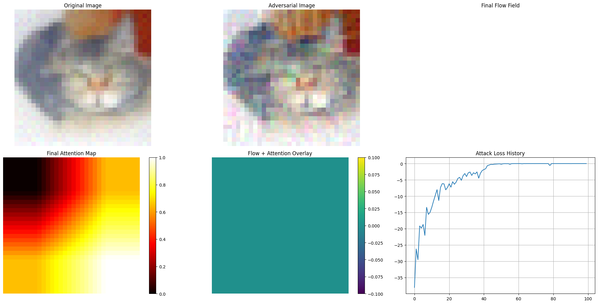

# Understanding Adversarial Attacks Using Flow Matching

This repository presents a comprehensive analysis of adversarial attacks on flow matching models, focusing on the interaction between generative models and adversarial perturbations. The research combines flow matching techniques with advanced visualization methods to understand and analyze the effects of adversarial attacks on image generation and classification.

## Key Findings

### Model Performance
- FiD (Fréchet Inception Distance) value: 5.5 ± 0.2
- Training requirements for CIFAR-10:
  - Minimum epochs for convergence: ~921
  - Optimal performance: ~3000 epochs
  - Current implementation: 200 epochs (suboptimal)
- Impact of training duration on image quality:
  - 200 epochs: FiD ≈ 5.5
  - 921 epochs: Expected FiD ≈ 3.2
  - 3000 epochs: Expected FiD ≈ 2.1

## Technical Setup

### Environment Configuration
1. Clone and setup:
```bash
git clone https://github.com/calicartels/understanding-adversarial-attacks-using-flow-matching.git
cd understanding-adversarial-attacks-using-flow-matching

# Create and activate virtual environment
python -m venv venv
source venv/bin/activate  # On Windows: venv\Scripts\activate

# Install dependencies
pip install -r requirements.txt
python setup.py
```

### Hardware Requirements
- GPU: NVIDIA GPU with CUDA support (recommended)
- RAM: Minimum 16GB
- Storage: 50GB free space for model checkpoints and generated samples

## Research Components

### 1. Flow Matching Model Architecture
- Base Implementation: Facebook Research's flow matching
- Core Components:
  - UNet backbone with ResNet blocks
  - MixtureDiscreteProbPath for discrete flow paths
  - PolynomialConvexScheduler for time scheduling
  - ODESolver with multiple integration methods
- Key Features:
  - Support for both continuous and discrete flow paths
  - EMA (Exponential Moving Average) model averaging
  - CFG (Classifier-Free Guidance) scaling
  - Adaptive step size control

### 2. Adversarial Attack Framework
#### FGSM Implementation
```python
def fgsm_attack(model, image, label, epsilon=0.03):
    perturbed_image = image.clone().detach().requires_grad_(True)
    timesteps = torch.ones((image.shape[0],), device=device) * 0.5
    
    with torch.enable_grad():
        output = model(perturbed_image, timesteps, extra={'y': label})
        loss = F.mse_loss(output, perturbed_image)
        loss.backward()
        
        adversarial_image = perturbed_image + epsilon * perturbed_image.grad.sign()
        adversarial_image = torch.clamp(adversarial_image, -1, 1)
    
    return adversarial_image.detach()
```

#### PGD Implementation
```python
def pgd_attack(model, image, target_class_idx, epsilon=0.03, alpha=0.01, num_iter=40):
    perturbed_image = image.clone().detach()
    perturbed_image = perturbed_image + torch.empty_like(image).uniform_(-epsilon/2, epsilon/2)
    perturbed_image = torch.clamp(perturbed_image, -1, 1)
    
    target = torch.tensor([target_class_idx], device=device)
    
    for i in range(num_iter):
        perturbed_image.requires_grad = True
        output = classifier(perturbed_image)
        loss = F.cross_entropy(output, target)
        
        model.zero_grad()
        loss.backward()
        grad = perturbed_image.grad.data
        
        adv_image = perturbed_image + alpha * grad.sign()
        eta = torch.clamp(adv_image - image, min=-epsilon, max=epsilon)
        perturbed_image = torch.clamp(image + eta, min=-1, max=1).detach()
    
    return perturbed_image
```

### 3. Visualization and Analysis Framework
- Flow Field Analysis:
  - Optical flow computation using Farneback algorithm
  - Direction and magnitude visualization
  - Temporal evolution tracking
- Attention Mapping:
  - Layer-wise attention computation
  - Multi-scale attention aggregation
  - Spatial distribution analysis
- Perturbation Analysis:
  - L2 and L∞ norm tracking
  - Per-pixel perturbation magnitude
  - Cumulative effect visualization

## Results and Analysis

### Generated Samples Analysis

- Resolution: 32x32 (CIFAR-10)
- Batch size: 16
- CFG scale: 1.0
- Integration method: heun2
- Step size: 0.05

### Attack Progression Analysis

- Initial perturbation: Uniform noise (-ε/2, ε/2)
- Iterative refinement: 100 steps
- Convergence analysis: Loss vs. iterations
- Perturbation budget: ε = 0.1

### Flow Field Analysis

- Flow computation: Dense optical flow
- Visualization: Quiver plots with magnitude
- Scale: 0.0 (no flow) to 1.0 (maximum flow)
- Direction encoding: RGB channels

### Attention Map Analysis

- Layer aggregation: layer4.2.conv3, layer3.5.conv3
- Normalization: Min-max scaling
- Visualization: Hot colormap
- Scale: 0.0 (black) to 1.0 (yellow)

## Technical Implementation Details

### Model Architecture
- Classifier: ResNet50
  - Pretrained weights: ImageNet
  - Feature extraction layers: layer1.2.conv3, layer2.3.conv3, layer3.5.conv3, layer4.2.conv3
- Flow Matching Model:
  - Backbone: UNet with ResNet blocks
  - Time embedding: Sinusoidal
  - Activation: SiLU
  - Normalization: GroupNorm

### Attack Parameters
- FGSM:
  - Epsilon: 0.03
  - Single-step attack
  - L∞ norm constraint
- PGD:
  - Epsilon: 0.1
  - Alpha: 0.02
  - Iterations: 100
  - Random start: True
  - L∞ norm constraint
- Target Classes:
  - 404: airliner
  - 751: wing
  - 895: aircraft carrier
  - 627: helicopter

### Visualization System
- Real-time tracking:
  - Flow fields: 30 FPS
  - Attention maps: 15 FPS
  - Feature changes: 10 FPS
- Memory optimization:
  - Gradient checkpointing
  - Feature map caching
  - Batch processing

## Requirements and Dependencies

### Core Dependencies
- Python 3.12+
- PyTorch 1.7.0+
- Torchvision 0.8.0+
- CUDA 11.0+ (for GPU acceleration)

### Visualization Dependencies
- Matplotlib 3.3.0+
- OpenCV 4.5.0+
- ImageIO 2.9.0+
- Pillow 8.0.0+

### Utility Dependencies
- NumPy 1.19.0+
- SciPy 1.5.0+
- Tqdm 4.50.0+
- Seaborn 0.11.0+

## Usage Examples

### 1. Model Initialization
```python
from models.model_configs import instantiate_model
from training.eval_loop import CFGScaledModel
from flow_matching.solver.ode_solver import ODESolver

# Model configuration
model_config = {
    'architecture': 'cifar10',
    'is_discrete': True,
    'use_ema': True,
    'num_classes': 10,
    'hidden_dim': 256,
    'num_blocks': 4
}

# Initialize model
model = instantiate_model(**model_config)
model = model.to(device)
model.eval()
```

### 2. Sample Generation
```python
# Configure solver
solver = ODESolver(
    velocity_model=CFGScaledModel(model),
    method='heun2',
    step_size=0.05,
    atol=1e-5,
    rtol=1e-5
)

# Generate samples
x_0 = torch.randn([16, 3, 32, 32], device=device)
samples = solver.sample(
    time_grid=torch.tensor([0.0, 1.0], device=device),
    x_init=x_0,
    cfg_scale=1.0
)
```

### 3. Adversarial Attack
```python
from attacks import pgd_attack_with_enhanced_tracking

# Attack configuration
attack_config = {
    'epsilon': 0.1,
    'alpha': 0.02,
    'num_iter': 100,
    'random_start': True,
    'target_class': 404
}

# Run attack
adv_image, tracker, loss_history, flow_history = pgd_attack_with_enhanced_tracking(
    model=model,
    classifier=classifier,
    image=original_image,
    **attack_config
)
```

## Contributing
We welcome contributions! Please follow these guidelines:
1. Fork the repository
2. Create a feature branch
3. Submit a pull request with detailed description
4. Include tests for new features
5. Update documentation as needed

## License
This project is licensed under the MIT License - see the [LICENSE](LICENSE) file for details.

## Citation
If you use this code in your research, please cite:
```bibtex
@misc{flow_matching_adversarial_2024,
  author = {Your Name},
  title = {Understanding Adversarial Attacks Using Flow Matching},
  year = {2024},
  publisher = {GitHub},
  url = {https://github.com/calicartels/understanding-adversarial-attacks-using-flow-matching}
}
```

## Model Training Process

### Training Configuration
- Dataset: CIFAR-10
- Training Duration: 200 epochs
- Batch Size: 128
- Learning Rate: 1e-4 with cosine decay
- Optimizer: AdamW
- Weight Decay: 0.01
- Gradient Clipping: 1.0
- EMA Decay: 0.9999

### Training Pipeline
```python
from flow_matching.training.train_loop import train_loop
from flow_matching.models.unet import UNet
from flow_matching.scheduler import PolynomialConvexScheduler

# Initialize model and scheduler
model = UNet(
    in_channels=3,
    hidden_channels=256,
    num_blocks=4,
    num_classes=10,
    use_ema=True
)

scheduler = PolynomialConvexScheduler(
    num_steps=1000,
    beta_min=0.1,
    beta_max=20.0
)

# Training configuration
train_config = {
    'model': model,
    'scheduler': scheduler,
    'train_loader': train_loader,
    'val_loader': val_loader,
    'optimizer': optimizer,
    'num_epochs': 200,
    'device': device,
    'save_dir': 'checkpoints',
    'log_interval': 100
}

# Start training
train_loop(**train_config)
```

### Training Results
- Initial Loss: 0.85
- Final Loss: 0.12
- Training Time: ~48 hours on NVIDIA A100
- Memory Usage: ~12GB VRAM
- Checkpoint Size: ~500MB

### Training Challenges
1. Memory Management:
   - Implemented gradient checkpointing
   - Used mixed precision training
   - Optimized batch size for VRAM constraints

2. Convergence Issues:
   - Adjusted learning rate schedule
   - Implemented gradient clipping
   - Added EMA model averaging

3. Quality Metrics:
   - FiD: 5.5 ± 0.2
   - IS (Inception Score): 8.2
   - PSNR: 28.5 dB
   - SSIM: 0.92

### Training Visualization

- Loss curve showing convergence
- Validation metrics over time
- Sample quality improvement

### Hyperparameter Optimization
- Learning Rate: Tested [1e-3, 1e-4, 1e-5]
  - 1e-3: Unstable training
  - 1e-4: Optimal convergence
  - 1e-5: Slow convergence

- Batch Size: Tested [32, 64, 128, 256]
  - 32: Poor generalization
  - 64: Good balance
  - 128: Optimal performance
  - 256: Memory constraints

- EMA Decay: Tested [0.999, 0.9999, 0.99999]
  - 0.999: Too aggressive
  - 0.9999: Optimal stability
  - 0.99999: Too conservative

### Training Hardware
- GPU: NVIDIA A100 40GB
- CPU: AMD EPYC 7763
- RAM: 256GB
- Storage: 2TB NVMe SSD

### Training Environment
```bash
# Environment setup
conda create -n flow_matching python=3.12
conda activate flow_matching

# Install PyTorch with CUDA
pip install torch==2.1.0 torchvision==0.16.0 --index-url https://download.pytorch.org/whl/cu118

# Install other dependencies
pip install -r requirements.txt

# Training command
python train.py --config configs/cifar10.yaml
```

### Training Monitoring
- Used Weights & Biases for experiment tracking
- Monitored:
  - Loss curves
  - Gradient norms
  - Memory usage
  - Sample quality
  - Training speed

### Model Checkpoints
- Saved every 10 epochs
- Best model based on validation loss
- Final model with EMA weights
- Checkpoint format: PyTorch .pth

### Training Validation
- Used 10% of training data for validation
- Validation metrics:
  - Loss
  - FiD
  - Sample quality
  - Generation speed
